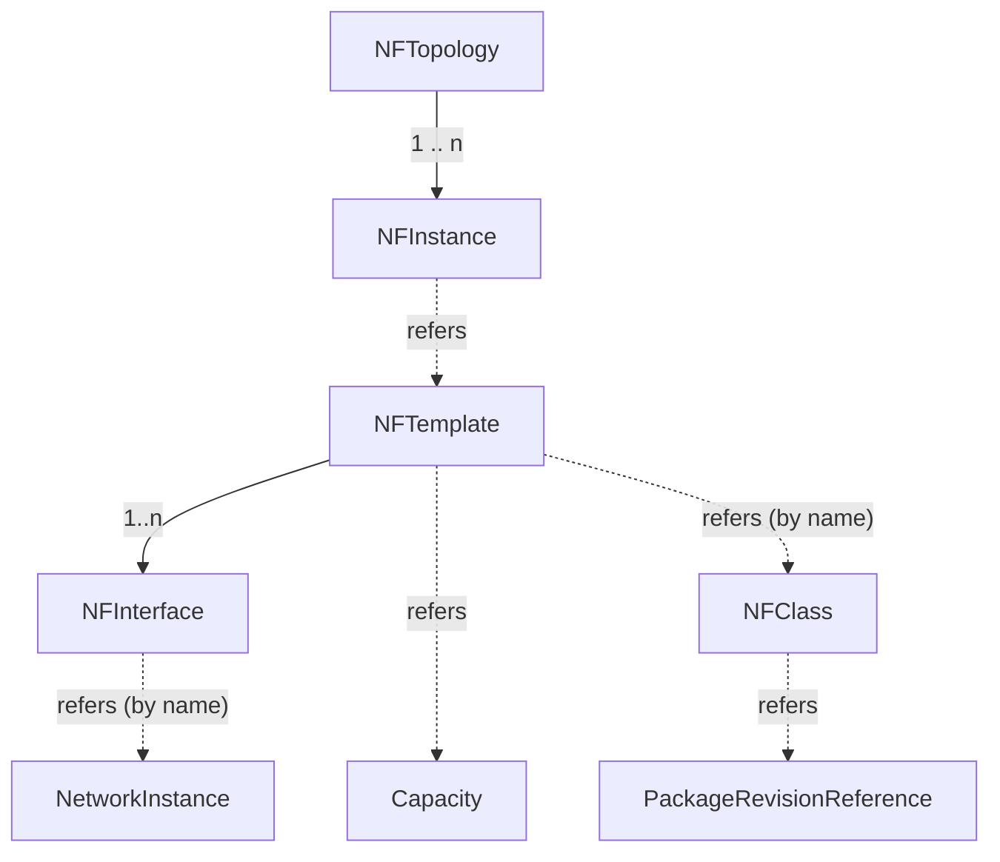

# Nephio APIs

## Overview

Nephio APIs primarily consist of a collection of Go API objects, CRDs and other KRM types,
specified and maintained in the [Nephio API repository](https://github.com/nephio-project/api).
this page aims to give a high level overview of the objects that are available and their
relationships, and is based on an
[original document](https://docs.google.com/document/d/1-5nlpY4FbuhWtdKTvIqPOv4bWmA6zx6TdHoEfk9Jc_Q/edit)
developed ny Tal Liron.

The aim is to keep these diagrams as simple as possible for now and only convey the important aspects of the modelled entities. As such they are intended to give a high-level overview of the entities and relationships that can be accessed and modified via the Nephio API, and provide reference to detailed documentation, generated from the code, where available.

## Topology

## Network Requirements

## Capacity Requirements

# Issues
Please raise any issues in the [nephio](https://github.com/nephio-project/nephio) repository
instead of in here, using the prefix "api: " in the issue title.

