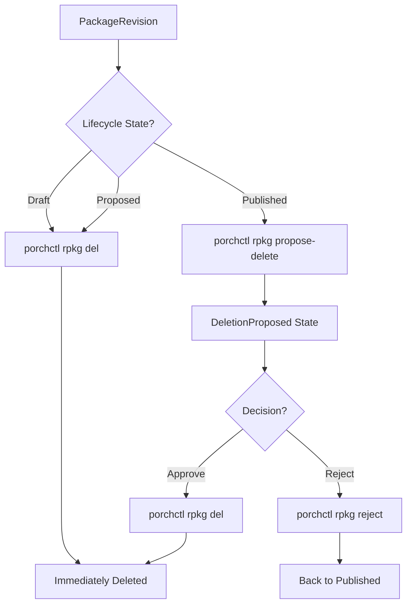

## Tutorial Overview

You will learn how to:

1. Delete Draft and Proposed PackageRevisions directly
2. Propose Published PackageRevisions for deletion
3. Approve or reject deletion proposals
4. Understand the deletion workflow and safety mechanisms

{}
This tutorial assumes a porch repository is initialized with the "porch-test" name.
Replace any "porch-test" value with your repository's name in the commands below.
{}

---

## Understanding PackageRevision Deletion

PackageRevision deletion in Porch follows different workflows depending on the lifecycle state:

**Direct Deletion:**

- **Draft** and **Proposed** PackageRevisions can be deleted immediately
- No approval process required
- Permanently removes the PackageRevision and its Git branch

**Deletion Proposal Workflow:**

- **Published** PackageRevisions require a two-step deletion process
- First propose deletion, then approve the proposal
- Provides safety mechanism to prevent accidental deletion of production packages

**Branch-Tracking PackageRevisions:**

- When you publish a PackageRevision, Porch automatically creates a "main" branch-tracking PackageRevision
- These have revision `-1` and workspace name `main`
- They track the current state of the package on the main Git branch
- **Important**: These are managed automatically by Porch and should not be directly modified
- The only user interaction should be deletion after all regular PackageRevisions of **that specific package** are deleted

---

## Step 1: Create Test PackageRevisions

Let's create some test PackageRevisions to demonstrate the deletion workflows:

```bash
# Create a Draft PackageRevision
porchctl rpkg init test-draft-package \
  --namespace=default \
  --repository=porch-test \
  --workspace=draft-v1 \
  --description="Test package for deletion"

# Create a Proposed PackageRevision
porchctl rpkg init test-proposed-package \
  --namespace=default \
  --repository=porch-test \
  --workspace=proposed-v1 \
  --description="Test package for deletion"

porchctl rpkg propose porch-test.test-proposed-package.proposed-v1 --namespace=default

# Create a Published PackageRevision
porchctl rpkg init test-published-package \
  --namespace=default \
  --repository=porch-test \
  --workspace=published-v1 \
  --description="Test package for deletion"

porchctl rpkg propose porch-test.test-published-package.published-v1 --namespace=default
porchctl rpkg approve porch-test.test-published-package.published-v1 --namespace=default
```

**Verify the PackageRevisions were created:**

```bash
porchctl rpkg get --namespace=default
```

You should see an output similar to:

```bash
NAME                                           PACKAGE                  WORKSPACENAME   REVISION   LATEST   LIFECYCLE   REPOSITORY
porch-test.test-draft-package.draft-v1         test-draft-package       draft-v1        0          false    Draft       porch-test
porch-test.test-proposed-package.proposed-v1   test-proposed-package    proposed-v1     0          false    Proposed    porch-test
porch-test.test-published-package.main         test-published-package   main            -1         false    Published   porch-test
porch-test.test-published-package.published-v1 test-published-package   published-v1    1          true     Published   porch-test
```

---

## Step 2: Delete Draft PackageRevisions

Draft PackageRevisions can be deleted immediately without any approval process:

```bash
porchctl rpkg del porch-test.test-draft-package.draft-v1 --namespace=default
```

**What this does:**

- Immediately removes the Draft PackageRevision
- Deletes the corresponding Git branch (`draft/draft-v1`)
- No approval or confirmation required

**Verify the deletion:**

```bash
porchctl rpkg get --namespace=default
```

The Draft PackageRevision should no longer appear in the list:

```bash
NAME                                           PACKAGE                  WORKSPACENAME   REVISION   LATEST   LIFECYCLE   REPOSITORY
porch-test.test-proposed-package.proposed-v1   test-proposed-package    proposed-v1     0          false    Proposed    porch-test
porch-test.test-published-package.main         test-published-package   main            -1         false    Published   porch-test
porch-test.test-published-package.published-v1 test-published-package   published-v1    1          true     Published   porch-test
```

---

## Step 3: Delete Proposed PackageRevisions

Proposed PackageRevisions can also be deleted directly:

```bash
porchctl rpkg del porch-test.test-proposed-package.proposed-v1 --namespace=default
```

**What this does:**

- Immediately removes the Proposed PackageRevision
- Deletes the corresponding Git branch (`proposed/proposed-v1`)
- No approval process required

**Verify the deletion:**

```bash
porchctl rpkg get --namespace=default
```

The Proposed PackageRevision should no longer appear in the list:

```bash
NAME                                           PACKAGE                  WORKSPACENAME   REVISION   LATEST   LIFECYCLE   REPOSITORY
porch-test.test-published-package.main         test-published-package   main            -1         false    Published   porch-test
porch-test.test-published-package.published-v1 test-published-package   published-v1    1          true     Published   porch-test
```

---

## Step 4: Propose Published PackageRevision for Deletion

Published PackageRevisions cannot be deleted directly. You must first propose them for deletion:

```bash
porchctl rpkg propose-delete porch-test.test-published-package.published-v1 --namespace=default
```

**What this does:**

- Changes the PackageRevision lifecycle from `Published` to `DeletionProposed`
- Signals that the PackageRevision should be deleted
- Requires approval before actual deletion occurs

**Verify the state change:**

```bash
porchctl rpkg get porch-test.test-published-package.published-v1 --namespace=default
```

The lifecycle should now show `DeletionProposed`:

```bash
NAME                                           PACKAGE                  WORKSPACENAME   REVISION   LATEST   LIFECYCLE         REPOSITORY
porch-test.test-published-package.main         test-published-package   main            -1         false    Published         porch-test
porch-test.test-published-package.published-v1 test-published-package   published-v1    1          true     DeletionProposed  porch-test
```

---

## Step 5a: Approve Deletion Proposal

If you want to proceed with the deletion, approve the deletion proposal:

```bash
porchctl rpkg del porch-test.test-published-package.published-v1 --namespace=default
```

**What this does:**

- Permanently deletes the PackageRevision
- Removes the Git tag and any associated branches
- **Important**: This cannot be undone once completed

**Verify the deletion:**

```bash
porchctl rpkg get --namespace=default
```

The published PackageRevision should no longer exist, but the main branch-tracking PackageRevision remains:

```bash
NAME                                    PACKAGE                  WORKSPACENAME   REVISION   LATEST   LIFECYCLE   REPOSITORY
porch-test.test-published-package.main  test-published-package   main            -1         false    Published   porch-test
```

---

## Step 5b: Reject Deletion Proposal (Alternative)

If you decide not to delete the PackageRevision, you can reject the deletion proposal:

```bash
# First, let's create another Published PackageRevision for this example
porchctl rpkg init test-reject-delete \
  --namespace=default \
  --repository=porch-test \
  --workspace=reject-v1 \
  --description="Test package for rejection"

porchctl rpkg propose porch-test.test-reject-delete.reject-v1 --namespace=default
porchctl rpkg approve porch-test.test-reject-delete.reject-v1 --namespace=default

# Propose it for deletion
porchctl rpkg propose-delete porch-test.test-reject-delete.reject-v1 --namespace=default

# Now reject the deletion proposal
porchctl rpkg reject porch-test.test-reject-delete.reject-v1 --namespace=default
```

**What this does:**

- Changes lifecycle from `DeletionProposed` back to `Published`
- PackageRevision returns to normal published state
- The package can be used again normally

**Verify the state change:**

```bash
porchctl rpkg get porch-test.test-reject-delete.reject-v1 --namespace=default
```

The lifecycle should be back to `Published`:

```bash
NAME                                    PACKAGE            WORKSPACENAME   REVISION   LATEST   LIFECYCLE   REPOSITORY
porch-test.test-reject-delete.reject-v1 test-reject-delete reject-v1       1          true     Published   porch-test
```

---

## Batch Deletion Operations

You can delete multiple PackageRevisions in a single command:

**Delete multiple Draft/Proposed PackageRevisions:**

```bash
porchctl rpkg del package1 package2 package3 --namespace=default
```

**Propose multiple Published PackageRevisions for deletion:**

```bash
porchctl rpkg propose-delete package1 package2 package3 --namespace=default
```

**Approve multiple deletion proposals:**

```bash
porchctl rpkg del package1 package2 package3 --namespace=default
```

---

## Deletion Workflow Summary

The complete deletion workflow depends on the PackageRevision lifecycle state:



---

## Safety Considerations

**Published PackageRevision Protection:**

- Two-step deletion process prevents accidental removal
- Deletion proposals can be reviewed before approval
- Rejected proposals restore the PackageRevision to Published state

**Git Repository Impact:**

- Draft/Proposed deletions remove Git branches
- Published deletions remove Git tags and references
- Deletion is permanent and cannot be undone

**Dependency Considerations:**

- Check if other PackageRevisions depend on the one being deleted
- Deleting upstream packages may affect downstream clones
- Consider the impact on deployed workloads

---

## Troubleshooting

**Cannot delete Published PackageRevision directly:**

```bash
Error: cannot delete published package revision directly, use propose-delete first
```

- Use `porchctl rpkg propose-delete` first, then `porchctl rpkg del`

**PackageRevision not found:**

- Verify the exact PackageRevision name: `porchctl rpkg get --namespace=default`
- Check you're using the correct namespace
- Ensure the PackageRevision hasn't already been deleted

**Permission denied:**

- Check RBAC permissions: `kubectl auth can-i delete packagerevisions -n default`
- Verify your service account has proper deletion roles

**Deletion proposal stuck:**

- Check the PackageRevision status: `porchctl rpkg get <name> -o yaml`
- Look for conditions that might prevent deletion
- Ensure no other processes are modifying the PackageRevision

---

## Complete Cleanup

After deleting PackageRevisions, you may notice "main" branch-tracking PackageRevisions still exist. These are automatically created by Porch when packages are published and must be deleted separately.

{}
Main branch-tracking PackageRevisions (with workspace name "main" and revision "-1") are managed automatically by Porch. Do not modify, propose, approve, or otherwise interact with them except for deletion after all regular PackageRevisions of that specific package have been removed.
{}

**Check for remaining PackageRevisions:**

```bash
porchctl rpkg get --namespace=default
```

You might see output like:

```bash
NAME                                    PACKAGE                  WORKSPACENAME   REVISION   LATEST   LIFECYCLE   REPOSITORY
porch-test.test-published-package.main test-published-package   main            -1         false    Published   porch-test
porch-test.test-reject-delete.main     test-reject-delete       main            -1         false    Published   porch-test
```

**Delete the main branch-tracking PackageRevisions:**

```bash
# Propose deletion of main branch PackageRevisions
porchctl rpkg propose-delete porch-test.test-published-package.main --namespace=default
porchctl rpkg propose-delete porch-test.test-reject-delete.main --namespace=default

# Approve the deletions
porchctl rpkg del porch-test.test-published-package.main --namespace=default
porchctl rpkg del porch-test.test-reject-delete.main --namespace=default
```

**Verify complete cleanup:**

```bash
porchctl rpkg get --namespace=default
```

All test PackageRevisions should now be removed.

---
