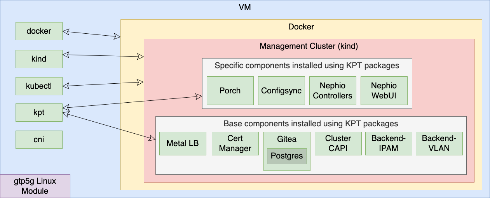

Exploring the Nephio Sandbox
============================

You have installed the Nephio sandbox on your VM
[using the installation instructions](https://github.com/nephio-project/test-infra/blob/main/e2e/provision/README.md). The installation has done a good job of installing a complex software stack without any fuss. Let's take a look around.



# Components Installed on the VM Itself

The following components are installed on the VM itself. These components are installed directly on the VM by the Ansible install scripts.

| Component | Purpose                                                                                  |
| --------- | ---------------------------------------------------------------------------------------- |
| docker    | Uused to host Kubernetes clusters created by KinD                                        |
| kind      | Used to create clusters in docker                                                        |
| kubectl   | Used to control clusters created by KinD                                                 |
| kpt       | Used to install packages (software and metadata) on k8s clusters                         |
| cni       | Used to implement the k8s network model for the KinD clusters                            |
| gtp5g     | A Linux module that supports the 3GPP GPRS tunneling protocol (required by free5gc NFs)  |

The Ansible install scripts use kind to create the Management cluster. Once the Management KinD cluster is created, the install uses kpt packages to install the remainder of the software.

# Components Installed on the Management KinD cluster

Everything is installed on the Management KinD cluster by Ansible scripts using kpt packages.

The install unpacks each kpt package in the */tmp* directory. It then applies the kpt functions to the packages and applies the packages to the Management KinD cluster. This allows the user to check the status of the kpt packages in the cluster using the *kpt live status* command on the unpacked packages in the */tmp* directory.

The rendered kpt packages containing components are unpacked in the */tmp/kpt-pkg* directory. The rendered kpt packages that create the *mgmt* and *mgmt-staging* repositories are unpacked in the */tmp/repository* directory. The rendered kpt package containing the rootsync configuration for the *mgmt* repository is unpacked in the */tmp/rootsync* directory. You can examine the contents of any rendered kpt packager by examining the contents of these directories.

```
/tmp/kpt-pkg/                           /tmp/repository     /tmp/rootsync/
├── cert-manager                        ├── mgmt            └── mgmt
├── cluster-capi                        └── mgmt-staging
├── cluster-capi-infrastructure-docker
├── cluster-capi-kind-docker-templates
├── configsync
├── gitea
├── metallb
├── metallb-sandbox-config
├── nephio-controllers
├── nephio-stock-repos
├── nephio-webui
├── porch-dev
└── resource-backend

```
<details>
 <summary>You can check the status of an applied kpt package using a "kpt live status package_dir" command.</summary>
 
```
kpt live status /tmp/kpt-pkg/nephio-controllers/
inventory-38069595/clusterrole.rbac.authorization.k8s.io//nephio-controller-approval-role is Current: Resource is current
inventory-38069595/clusterrole.rbac.authorization.k8s.io//nephio-controller-bootstrap-role is Current: Resource is current
inventory-38069595/clusterrole.rbac.authorization.k8s.io//nephio-controller-controller-role is Current: Resource is current
inventory-38069595/clusterrole.rbac.authorization.k8s.io//nephio-controller-network-role is Current: Resource is current
inventory-38069595/clusterrole.rbac.authorization.k8s.io//nephio-controller-porch-role is Current: Resource is current
inventory-38069595/clusterrole.rbac.authorization.k8s.io//nephio-controller-repository-role is Current: Resource is current
inventory-38069595/clusterrole.rbac.authorization.k8s.io//nephio-controller-token-role is Current: Resource is current
inventory-38069595/clusterrolebinding.rbac.authorization.k8s.io//nephio-controller-approval-role-binding is Current: Resource is current
inventory-38069595/clusterrolebinding.rbac.authorization.k8s.io//nephio-controller-bootstrap-role-binding is Current: Resource is current
inventory-38069595/clusterrolebinding.rbac.authorization.k8s.io//nephio-controller-controller-role-binding is Current: Resource is current
inventory-38069595/clusterrolebinding.rbac.authorization.k8s.io//nephio-controller-network-role-binding is Current: Resource is current
inventory-38069595/clusterrolebinding.rbac.authorization.k8s.io//nephio-controller-porch-role-binding is Current: Resource is current
inventory-38069595/clusterrolebinding.rbac.authorization.k8s.io//nephio-controller-repository-role-binding is Current: Resource is current
inventory-38069595/clusterrolebinding.rbac.authorization.k8s.io//nephio-controller-token-role-binding is Current: Resource is current
inventory-38069595/deployment.apps/nephio-system/nephio-controller is Current: Deployment is available. Replicas: 1
inventory-38069595/deployment.apps/nephio-system/token-controller is Current: Deployment is available. Replicas: 1
inventory-38069595/role.rbac.authorization.k8s.io/nephio-system/nephio-controller-leader-election-role is Current: Resource is current
inventory-38069595/rolebinding.rbac.authorization.k8s.io/nephio-system/nephio-controller-leader-election-role-binding is Current: Resource is current
inventory-38069595/serviceaccount/nephio-system/nephio-controller is Current: Resource is current
inventory-38069595/customresourcedefinition.apiextensions.k8s.io//networks.config.nephio.org is Current: CRD is established
inventory-38069595/customresourcedefinition.apiextensions.k8s.io//clustercontexts.infra.nephio.org is Current: CRD is established
inventory-38069595/customresourcedefinition.apiextensions.k8s.io//networkconfigs.infra.nephio.org is Current: CRD is established
inventory-38069595/customresourcedefinition.apiextensions.k8s.io//networks.infra.nephio.org is Current: CRD is established
inventory-38069595/customresourcedefinition.apiextensions.k8s.io//repositories.infra.nephio.org is Current: CRD is established
inventory-38069595/customresourcedefinition.apiextensions.k8s.io//tokens.infra.nephio.org is Current: CRD is established
inventory-38069595/customresourcedefinition.apiextensions.k8s.io//workloadclusters.infra.nephio.org is Current: CRD is established
inventory-38069595/customresourcedefinition.apiextensions.k8s.io//capacities.req.nephio.org is Current: CRD is established
inventory-38069595/customresourcedefinition.apiextensions.k8s.io//datanetworknames.req.nephio.org is Current: CRD is established
inventory-38069595/customresourcedefinition.apiextensions.k8s.io//datanetworks.req.nephio.org is Current: CRD is established
inventory-38069595/customresourcedefinition.apiextensions.k8s.io//interfaces.req.nephio.org is Current: CRD is established
inventory-38069595/customresourcedefinition.apiextensions.k8s.io//amfdeployments.workload.nephio.org is Current: CRD is established
inventory-38069595/customresourcedefinition.apiextensions.k8s.io//smfdeployments.workload.nephio.org is Current: CRD is established
inventory-38069595/customresourcedefinition.apiextensions.k8s.io//upfdeployments.workload.nephio.org is Current: CRD is established
inventory-38069595/namespace//nephio-system is Current: Resource is current
```
</details>

## Base Components

The following base components are installed on the Management cluster. Base components are the infrastructure components that are needed for the Nephio sandbox, which Nephio uses out of the box. In real world installations, alternative components that provide the same functionality may be used.

| Component    | Purpose                                                            |
| ------------ | -------------------------------------------------------------------|
| Metal LB     | Used to load balances requests to the cluster                      |
| Cert Manager | Used for certificate management                                    |
| Gitea        | Used to allow creation and management of local git repos by Nephio |
| Postgres     | Used by Gitea to store repositories                                |
| Cluster CAPI | Used deploy Workload clusters                                 |
| IPAM         | A reference backend system to allocate and manage IP addresses     |
| VLAN         | A reference backend system used to allocate and manage VLANs       |

## Specific Components

The following specific components are installed on the Management cluster. The specific components are Nephio components and components from
[Google Container Tools](https://github.com/GoogleContainerTools) that Nephio uses heavily and interacts closely with.

| Component          | Purpose                                                                                                                                                      |
| ------------------ | -------------------------------------------------------------------------------------------------------------------------------------------------------------|
| Porch              | Google Container Tools Package Orchestration Server, provides an API used by Nephio to work with packages in git repos                                       |
| Configsync         | Google Container Tools Configuration Synchronization, used by Nephio to deploy configurations from repos from the Management cluster onto Workload clusters  |
| Nephio Controllers | The Nephio controllers, which implement the Nephio functionality to fetch, manipulate, and deploy NFs                                                        |
| Nephio WebUI       | The Nephio web client                                                                                                                                        |

# Some Useful Commands

<details>
<summary>Easily get the kubeconfig for a CAPI KinD cluster:</summary>

```bash
get_capi_kubeconfig regional
```

will create a file `regional-kubeconfig` used to connect to that
cluster.

</details>

<details>
<summary>You can query docker to see the docker images running KinD
clusters:</summary>

```bash
docker ps
```

The output is similar to:

```console
CONTAINER ID   IMAGE                  COMMAND                  CREATED      STATUS      PORTS                       NAMES
350b4a7e29f8   kindest/node:v1.27.1   "/usr/local/bin/entr…"   4 days ago   Up 4 days   127.0.0.1:44695->6443/tcp   kind-control-plane
```
</details>

<details>
<summary>Querying running KinD clusters after the install produces output similar to:</summary>

```bash
kind get clusters
```

The output is similar to:

```console
kind
```
</details>

<details>
<summary>Querying the k8s pods running after the install produces output similar to:</summary>

```bash
kubectl get pods -A --field-selector=metadata.namespace!=kube-system
```

The output is similar to:

```console
NAMESPACE                           NAME                                                            READY   STATUS    RESTARTS       AGE
backend-system                      resource-backend-controller-6c7cc59945-sv59w                    2/2     Running   6 (105m ago)   41h
capd-system                         capd-controller-manager-c479754b7-dwmps                         1/1     Running   6 (105m ago)   41h
capi-kubeadm-bootstrap-system       capi-kubeadm-bootstrap-controller-manager-bcdfbf4c5-8xnz6       1/1     Running   6 (105m ago)   41h
capi-kubeadm-control-plane-system   capi-kubeadm-control-plane-controller-manager-b9485b857-7hr6x   1/1     Running   0              41h
capi-system                         capi-controller-manager-9d9548dc8-cs6dv                         1/1     Running   6 (105m ago)   41h
cert-manager                        cert-manager-7476c8fcf4-ctfbp                                   1/1     Running   0              41h
cert-manager                        cert-manager-cainjector-bdd866bd4-vlgx2                         1/1     Running   0              41h
cert-manager                        cert-manager-webhook-5655dcfb4b-k5p2z                           1/1     Running   0              41h
config-management-monitoring        otel-collector-798c8784bd-79bd8                                 1/1     Running   0              41h
config-management-system            config-management-operator-6946b77565-s8sm7                     1/1     Running   0              41h
config-management-system            reconciler-manager-5b5d8557-prsfm                               2/2     Running   0              41h
config-management-system            root-reconciler-mgmt-6fdf94dfd4-6cngg                           4/4     Running   0              40h
gitea                               gitea-0                                                         1/1     Running   0              41h
gitea                               gitea-memcached-6777864fbd-q7c78                                1/1     Running   0              41h
gitea                               gitea-postgresql-0                                              1/1     Running   0              41h
local-path-storage                  local-path-provisioner-6bc4bddd6b-zl78t                         1/1     Running   0              41h
metallb-system                      controller-7948676b95-l554z                                     1/1     Running   0              41h
metallb-system                      speaker-v6lml                                                   1/1     Running   0              41h
nephio-system                       nephio-controller-76db4b45b7-g44w6                              2/2     Running   0              41h
nephio-system                       token-controller-75c98bd77-7kl4k                                2/2     Running   0              41h
nephio-webui                        nephio-webui-7df7bb7c45-9xmcx                                   1/1     Running   0              41h
porch-system                        function-runner-5d4f65476d-hjn6v                                1/1     Running   0              41h
porch-system                        function-runner-5d4f65476d-jvlm7                                1/1     Running   0              41h
porch-system                        porch-controllers-646dfb5f6-lxthk                               1/1     Running   0              41h
porch-system                        porch-server-69445b4d58-mkqqt                                   1/1     Running   28 (41m ago)   41h
resource-group-system               resource-group-controller-manager-6c9d56d88-njjr6               3/3     Running   6 (105m ago)   41h
```
</details>

<details>
<summary>Querying the repositories that exist after the install produces output similar to:</summary>

```bash
kubectl get repositories
```

The output is similar to:

```console
NAME                      TYPE   CONTENT   DEPLOYMENT   READY   ADDRESS
free5gc-packages          git    Package   false        True    https://github.com/nephio-project/free5gc-packages.git
mgmt                      git    Package   true         True    http://172.18.0.200:3000/nephio/mgmt.git
mgmt-staging              git    Package   false        True    http://172.18.0.200:3000/nephio/mgmt-staging.git
nephio-example-packages   git    Package   false        True    https://github.com/nephio-project/nephio-example-packages.git
```
</details>

<details>
<summary>exist after the install produces output similar to:</summary>

```
kubectl get repositories
```

The output is similar to:

```console
NAME                      TYPE   CONTENT   DEPLOYMENT   READY   ADDRESS
free5gc-packages          git    Package   false        True    https://github.com/nephio-project/free5gc-packages.git
mgmt                      git    Package   true         True    http://172.18.0.200:3000/nephio/mgmt.git
mgmt-staging              git    Package   false        True    http://172.18.0.200:3000/nephio/mgmt-staging.git
nephio-example-packages   git    Package   false        True    https://github.com/nephio-project/nephio-example-packages.git
```
</details>
