# Quick Start Exercises

## Table of Contents

- [Introduction](#introduction)
- [Create the Regional cluster](#step-1-create-the-regional-cluster)
- [Check the Regional cluster installation](#step-2-check-the-regional-cluster-installation)
- [Deploy two Edge clusters](#step-3-deploy-two-edge-clusters)
- [Deploy Free5GC control plane functions](#step-4-deploy-free5Gc-control-plane-functions)
- [Deploy Free5GC Operator in the Workload clusters](#step-5-deploy-free5GC-operator-in-the-workload-clusters)
- [Check Free5GC Operator deployment](#step-6-check-free5GC-operator-deployment)
- [Deploy AMF, SMF and UPF](#step-7-deploy-the-amf-smf-and-upf-nfs)
- [Deploy UERANSIM](#step-8-deploy-UERANSIM)
- [Change the Capacities of the UPF and SMF NFs](#step-9-change-the-capacities-of-the-upf-and-smf-nfs)

## Introduction

Be sure you have followed the [installation
guide](https://github.com/nephio-project/docs/blob/main/install-guide/README.md)
before trying these exercises.

These exercises will take you from a system with only the Nephio Management
cluster setup to a deployment with:
- A Regional cluster
- Two Edge clusters
- Repositories for each cluster, registered with Nephio, and with Config Sync
  set up to pull from those repositories.
- Inter-cluster networking between those clusters
- A complete free5gc deployment including:
  - AUSF, NRF, NSSF, PCF, UDM, UDR running on the Regional cluster and
    communicating via the Kubernetes default network
  - SMF, AMF running on the Regional cluster and attached to the secondary
    Multus networks as needed
  - UPF running on the Edge clusters and attached to the secondary Multus
    networks as needed
  - The free5gc WebUI and MongoDB as supporting services
- A registered subscriber in the free5gc core
- UERANSIM running on the edge01 cluster and simulating a gNB and the subscriber's
  UE

The network configuration is illustrated in the following figure:

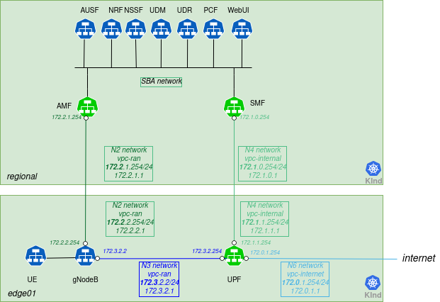

Note that for simplicity, only one edge cluster is represented.

Additionally, you can use Nephio to change the capacity requirement for the UPF and
SMF NFs and see how the free5gc operator translates that into increased memory and
CPU requirements for the underlying workload.

To perform these exercises, you will need:
- Access to the installed demo VM environment and can login as the
  `ubuntu` user to have access to the necessary files.
- Access to the Nephio UI as described in the installation guide

Access to Gitea, used in the demo environment as the Git provider, is
optional. Later in the exercises, you will also access the free5gc Web UI.

## Step 1: Create the Regional cluster

Our e2e topology consists of one Regional cluster, and two Edge clusters.
Let's start by deploying the Regional cluster. In this case, you will use
manual kpt commands to deploy a single cluster. First, check to make sure
that both the mgmt and mgmt-staging repositories are in the Ready state.
The mgmt repository is used to manage the contents of the Management
cluster via Nephio; the mgmt-staging repository is just used internally
during the cluster bootstrapping process.

Use the session just started on the VM to run these commands:

```bash
kubectl get repositories
```

<details>
<summary>The output is similar to:</summary>

```console
NAME                      TYPE   CONTENT   DEPLOYMENT   READY   ADDRESS
free5gc-packages          git    Package   false        True    https://github.com/nephio-project/free5gc-packages.git
mgmt                      git    Package   true         True    http://172.18.0.200:3000/nephio/mgmt.git
mgmt-staging              git    Package   false        True    http://172.18.0.200:3000/nephio/mgmt-staging.git
nephio-example-packages   git    Package   false        True    https://github.com/nephio-project/nephio-example-packages.git
```
</details>

Since those are Ready, you can deploy a package from the
nephio-example-packages repository into the mgmt repository. To do this, you
retrieve the Package Revision name using `kpt alpha rpkg get`, clone
that specific Package Revision via the `kpt alpha rpkg clone` command, then
propose and approve the resulting package revision. You want to use the latest
revision of the nephio-workload-cluster package, which you can get with the
command below (your latest revision may be different):

```bash
kpt alpha rpkg get --name nephio-workload-cluster
```

<details>
<summary>The output is similar to:</summary>

```console
NAME                                                               PACKAGE                   WORKSPACENAME   REVISION   LATEST   LIFECYCLE   REPOSITORY
nephio-example-packages-05707c7acfb59988daaefd85e3f5c299504c2da1   nephio-workload-cluster   main            main       false    Published   nephio-example-packages
nephio-example-packages-781e1c17d63eed5634db7b93307e1dad75a92bce   nephio-workload-cluster   v1              v1         false    Published   nephio-example-packages
nephio-example-packages-5929727104f2c62a2cb7ad805dabd95d92bf727e   nephio-workload-cluster   v2              v2         false    Published   nephio-example-packages
nephio-example-packages-cdc6d453ae3e1bd0b64234d51d575e4a30980a77   nephio-workload-cluster   v3              v3         false    Published   nephio-example-packages
nephio-example-packages-c78ecc6bedc8bf68185f28a998718eed8432dc3b   nephio-workload-cluster   v4              v4         false    Published   nephio-example-packages
nephio-example-packages-46b923a6bbd09c2ab7aa86c9853a96cbd38d1ed7   nephio-workload-cluster   v5              v5         false    Published   nephio-example-packages
nephio-example-packages-17bffe318ac068f5f9ef22d44f08053e948a3683   nephio-workload-cluster   v6              v6         false    Published   nephio-example-packages
nephio-example-packages-0fbaccf6c5e75a3eff7976a523bb4f42bb0118ce   nephio-workload-cluster   v7              v7         false    Published   nephio-example-packages
nephio-example-packages-7895e28d847c0296a204007ed577cd2a4222d1ea   nephio-workload-cluster   v8              v8         false    Published   nephio-example-packages
nephio-example-packages-48cea934a3bd876b775099ab59e7c12456888ffd   nephio-workload-cluster   v9              v9         true     Published   nephio-example-packages
```
</details>

Then, use the NAME from that in the `clone` operation, and the resulting
PackageRevision name to perform the `propose` and `approve` operations:

```bash
kpt alpha rpkg clone -n default nephio-example-packages-48cea934a3bd876b775099ab59e7c12456888ffd --repository mgmt regional
```

<details>
<summary>The output is similar to:</summary>

```console
mgmt-08c26219f9879acdefed3469f8c3cf89d5db3868 created
```
</details>

Next, you will want to ensure that the new Regional cluster is labeled as regional.
Since you are using the CLI, you will need to pull the package out, modify it, and
then push the updates back to the Draft revision. You will use `kpt` and the
`set-labels` function to do this.

To pull the package to a local directory, use the `rpkg pull` command:

```bash
kpt alpha rpkg pull -n default mgmt-08c26219f9879acdefed3469f8c3cf89d5db3868 regional
```

The package is now in the `regional` directory. So you can execute the
`set-labels` function against the package imperatively, using `kpt fn eval`:

```bash
kpt fn eval --image gcr.io/kpt-fn/set-labels:v0.2.0 regional -- "nephio.org/site-type=regional" "nephio.org/region=us-west1"
```

<details>
<summary>The output is similar to:</summary>

```console
[RUNNING] "gcr.io/kpt-fn/set-labels:v0.2.0"
[PASS] "gcr.io/kpt-fn/set-labels:v0.2.0" in 3.7s
  Results:
    [info]: set 18 labels in total
```
</details>

If you wanted to, you could have used the `--save` option to add the
`set-labels` call to the package pipeline. This would mean that function gets
called whenever the server saves the package. If you added new resources
later, they would also get labeled.

In any case, you now can push the package with the labels applied back to the
repository:

```bash
kpt alpha rpkg push -n default mgmt-08c26219f9879acdefed3469f8c3cf89d5db3868 regional
```

<details>
<summary>The output is similar to:</summary>

```console
[RUNNING] "gcr.io/kpt-fn/apply-replacements:v0.1.1" 
[PASS] "gcr.io/kpt-fn/apply-replacements:v0.1.1"
```
</details>

Finally, you propose and approve the package.

```bash
kpt alpha rpkg propose -n default mgmt-08c26219f9879acdefed3469f8c3cf89d5db3868
```

<details>
<summary>The output is similar to:</summary>

```console
mgmt-08c26219f9879acdefed3469f8c3cf89d5db3868 proposed
```
</details>

```bash
kpt alpha rpkg approve -n default mgmt-08c26219f9879acdefed3469f8c3cf89d5db3868
```

<details>
<summary>The output is similar to:</summary>

```console
mgmt-08c26219f9879acdefed3469f8c3cf89d5db3868 approved
```
</details>

ConfigSync running in the Management cluster will now pull out this new
package, create all the resources necessary to provision a KinD cluster, and
register it with Nephio. This will take about five minutes or so.

## Step 2: Check the Regional cluster installation

You can check if the cluster has been added to the management cluster:

```bash
kubectl get cl
```
or
```bash
kubectl get clusters.cluster.x-k8s.io
```
<details>
<summary>The output is similar to:</summary>

```console
NAME       PHASE         AGE     VERSION
regional   Provisioned   52m     v1.26.3
```
</details>

To access the API server of that cluster, you
need to retrieve the `kubeconfig` file by pulling it from the Kubernetes Secret and decode the base64
encoding:

```bash
kubectl get secret regional-kubeconfig -o jsonpath='{.data.value}' | base64 -d > $HOME/.kube/regional-kubeconfig
export KUBECONFIG=$HOME/.kube/config:$HOME/.kube/regional-kubeconfig
```

You can then use it to access the Workload cluster directly:

```bash
kubectl get ns --context regional-admin@regional
```

<details>
<summary>The output is similar to:</summary>

```console
NAME                           STATUS   AGE
config-management-monitoring   Active   3h35m
config-management-system       Active   3h35m
default                        Active   3h39m
kube-node-lease                Active   3h39m
kube-public                    Active   3h39m
kube-system                    Active   3h39m
```
</details>

You should also check that the KinD cluster has come up fully with `kubectl get
machinesets`. You should see READY and AVAILABLE replicas.

```bash
kubectl get machinesets
```

<details>
<summary>The output is similar to:</summary>

```console
NAME                                   CLUSTER    REPLICAS   READY   AVAILABLE   AGE     VERSION
regional-md-0-zhw2j-58d497c498xkz96z   regional   1          1       1           3h58m   v1.26.3
```
</details>

## Step 3: Deploy two Edge clusters

Next, you can deploy two Edge clusters by applying the
PackageVariantSet that can be found in the `tests` directory:

```bash
kubectl apply -f test-infra/e2e/tests/002-edge-clusters.yaml
```

<details>
<summary>The output is similar to:</summary>

```console
packagevariantset.config.porch.kpt.dev/edge-clusters created
```
</details>

You should also check that the KinD cluster has come up fully with `kubectl get
machinesets`. You should see READY and AVAILABLE replicas.

```bash
kubectl get machinesets
```

<details>
<summary>The output is similar to:</summary>

```console
NAME                                   CLUSTER    REPLICAS   READY   AVAILABLE   AGE    VERSION
edge01-md-0-p5vwv-98cb4b55cx58l8l      edge01     1          1       1           114m   v1.26.3
edge02-md-0-4nfpb-797dc6ddd7x8fc56     edge02     1          1       1           114m   v1.26.3
```
</details>

This is equivalent to doing the same `kpt` commands used earlier for the Regional
cluster, except that it uses the PackageVariantSet controller, which is
running in the Nephio Management cluster. It will
clone the package for each entry in the field `packageNames` in the
PackageVariantSet. You can observe the progress by looking at the UI, or by
using `kubectl` to monitor the various package variants, package revisions,
and KinD clusters.

To access the API server of these clusters, you will
need to get the `kubeconfig` file. To retrieve the file, you
pull it from the Kubernetes Secret and decode the base64 encoding:

```bash
kubectl get secret edge01-kubeconfig -o jsonpath='{.data.value}' | base64 -d > $HOME/.kube/edge01-kubeconfig
kubectl get secret edge02-kubeconfig -o jsonpath='{.data.value}' | base64 -d > $HOME/.kube/edge02-kubeconfig
export KUBECONFIG=$HOME/.kube/config:$HOME/.kube/regional-kubeconfig:$HOME/.kube/edge01-kubeconfig:$HOME/.kube/edge02-kubeconfig
```

To retain the KUBECONFIG environment variable permanently across sessions for the
user, add it to the `~/.bash_profile` and source the `~/.bash_profile` file
```bash
echo "export KUBECONFIG=$HOME/.kube/config:$HOME/.kube/regional-kubeconfig:$HOME/.kube/edge01-kubeconfig:$HOME/.kube/edge02-kubeconfig" >> ~/.bash_profile
source ~/.bash_profile
```

Once the Edge clusters are ready, it is necessary to connect them. For now you
are using the [containerlab tool](https://containerlab.dev/). Eventually, the
inter-cluster networking will be automated as well.

```bash
./test-infra/e2e/provision/hacks/inter-connect_workers.sh
```

<details>
<summary>The output is similar to:</summary>

```console
{"workers":["edge01-md-0-nqjqm-b89c57dc5x8bxqk-l4bm9","edge02-md-0-m2t95-7f9f97c885x8cq64-9nf9r","regional-md-0-68wr8-9664894cxqdhph-bp59q"]}
INFO[0000] Containerlab v0.41.2 started
INFO[0000] Parsing & checking topology file: 002-topo.gotmpl
INFO[0000] Could not read docker config: open /root/.docker/config.json: no such file or directory
INFO[0000] Pulling ghcr.io/nokia/srlinux:22.11.2-116 Docker image
INFO[0056] Done pulling ghcr.io/nokia/srlinux:22.11.2-116
INFO[0056] Creating lab directory: /home/ubuntu/clab-free5gc-net
INFO[0056] Creating container: "leaf"
INFO[0058] Creating virtual wire: leaf:e1-2 <--> edge02-md-0-m2t95-7f9f97c885x8cq64-9nf9r:eth1
INFO[0058] Creating virtual wire: leaf:e1-3 <--> regional-md-0-68wr8-9664894cxqdhph-bp59q:eth1
INFO[0058] Creating virtual wire: leaf:e1-1 <--> edge01-md-0-nqjqm-b89c57dc5x8bxqk-l4bm9:eth1
INFO[0058] Running postdeploy actions for Nokia SR Linux 'leaf' node
INFO[0076] Adding containerlab host entries to /etc/hosts file
INFO[0076] 🎉 New containerlab version 0.42.0 is available! Release notes: https://containerlab.dev/rn/0.42/
Run 'containerlab version upgrade' to upgrade or go check other installation options at https://containerlab.dev/install/
+---+------------------------------------------+--------------+-----------------------------------+---------------+---------+----------------+--------------------------+
| # |                   Name                   | Container ID |               Image               |     Kind      |  State  |  IPv4 Address  |       IPv6 Address       |
+---+------------------------------------------+--------------+-----------------------------------+---------------+---------+----------------+--------------------------+
| 1 | edge01-md-0-nqjqm-b89c57dc5x8bxqk-l4bm9  | f2fc7ace220b | kindest/node:v1.26.3              | ext-container | running | 172.18.0.10/16 | fc00:f853:ccd:e793::a/64 |
| 2 | edge02-md-0-m2t95-7f9f97c885x8cq64-9nf9r | 22b81815901e | kindest/node:v1.26.3              | ext-container | running | 172.18.0.11/16 | fc00:f853:ccd:e793::b/64 |
| 3 | regional-md-0-68wr8-9664894cxqdhph-bp59q | 20dfc8f0be2a | kindest/node:v1.26.3              | ext-container | running | 172.18.0.5/16  | fc00:f853:ccd:e793::5/64 |
| 4 | net-free5gc-net-leaf                     | 1c21153a1acb | ghcr.io/nokia/srlinux:22.11.2-116 | srl           | running | 172.18.0.12/16 | fc00:f853:ccd:e793::c/64 |
+---+------------------------------------------+--------------+-----------------------------------+---------------+---------+----------------+--------------------------+
```
</details>

You will also need to configure the nodes for the VLANs. Again, this
will be automated in a future release that addresses node setup and
inter-cluster networking. For now, you must run a script that creates them
in each of the worker nodes.

```bash
./test-infra/e2e/provision/hacks/vlan-interfaces.sh
```

<details>
<summary>The output is similar to:</summary>

```console
docker exec "edge01-md-0-znvpq-56ff577758xjgj8b-qbrzh" ip link add link eth1 name eth1.2 type vlan id 2
docker exec "edge01-md-0-znvpq-56ff577758xjgj8b-qbrzh" ip link add link eth1 name eth1.3 type vlan id 3
docker exec "edge01-md-0-znvpq-56ff577758xjgj8b-qbrzh" ip link add link eth1 name eth1.4 type vlan id 4
docker exec "edge01-md-0-znvpq-56ff577758xjgj8b-qbrzh" ip link set up eth1.2
docker exec "edge01-md-0-znvpq-56ff577758xjgj8b-qbrzh" ip link set up eth1.3
docker exec "edge01-md-0-znvpq-56ff577758xjgj8b-qbrzh" ip link set up eth1.4
docker exec "edge02-md-0-kk5rv-6d944f5f4cx8fb4n-42ttj" ip link add link eth1 name eth1.2 type vlan id 2
docker exec "edge02-md-0-kk5rv-6d944f5f4cx8fb4n-42ttj" ip link add link eth1 name eth1.3 type vlan id 3
docker exec "edge02-md-0-kk5rv-6d944f5f4cx8fb4n-42ttj" ip link add link eth1 name eth1.4 type vlan id 4
docker exec "edge02-md-0-kk5rv-6d944f5f4cx8fb4n-42ttj" ip link set up eth1.2
docker exec "edge02-md-0-kk5rv-6d944f5f4cx8fb4n-42ttj" ip link set up eth1.3
docker exec "edge02-md-0-kk5rv-6d944f5f4cx8fb4n-42ttj" ip link set up eth1.4
docker exec "regional-md-0-6hqq6-79bf858cd5xcxzl8-6x9d7" ip link add link eth1 name eth1.2 type vlan id 2
docker exec "regional-md-0-6hqq6-79bf858cd5xcxzl8-6x9d7" ip link add link eth1 name eth1.3 type vlan id 3
docker exec "regional-md-0-6hqq6-79bf858cd5xcxzl8-6x9d7" ip link add link eth1 name eth1.4 type vlan id 4
docker exec "regional-md-0-6hqq6-79bf858cd5xcxzl8-6x9d7" ip link set up eth1.2
docker exec "regional-md-0-6hqq6-79bf858cd5xcxzl8-6x9d7" ip link set up eth1.3
docker exec "regional-md-0-6hqq6-79bf858cd5xcxzl8-6x9d7" ip link set up eth1.4
```
</details>


Finally, you want to configure the resource backend to be aware of these clusters.
The resource backend is an IP address and VLAN index management system. It is
included for demonstration purposes to show how Nephio package specialization
can interact with external systems to fully configure packages. But it needs to
be configured to match our topology.

First, you will apply a package to define the high-level networks for attaching our
workloads. The Nephio package specialization pipeline will
determine the exact VLAN tags and IP addresses for those attachments based on
the specific clusters. There is a predefined PackageVariant in the tests
directory for this:

```bash
kubectl apply -f test-infra/e2e/tests/003-network.yaml
```

<details>
<summary>The output is similar to:</summary>

```console
packagevariant.config.porch.kpt.dev/network created
```
</details>

Then you will create appropriate `Secret` to make sure that Nephio can authenticate to the external backend.

```bash
kubectl apply -f test-infra/e2e/tests/003-secret.yaml
```

<details>
<summary>The output is similar to:</summary>

```console
secret/srl.nokia.com created
```
</details>

The predefined PackageVariant package defines certain resources that exist for the entire topology.
However, you also need to configure the resource backend for our particular
topology. This will likely be automated in the future, but for now you can
just directly apply the configuration you have created that matches this test
topology. Within this step also the credentials and information is provided
to configure the network device, that aligns with the topology.

```bash
./test-infra/e2e/provision/hacks/network-topo.sh

kubectl apply -f test-infra/e2e/tests/003-network-topo.yaml
```

<details>
<summary>The output is similar to:</summary>

```console
rawtopology.topo.nephio.org/nephio created
```
</details>

## Step 4: Deploy Free5GC Control Plane Functions

While the Edge clusters are deploying (which will take 5-10 minutes), you can
install the free5gc functions other than SMF, AMF, and UPF. For this,
you will use the Regional cluster. Since these are all installed with a single
package, you can use the UI to pick the `free5gc-cp` package from the
`free5gc-packages` repository and clone it to the `regional` repository (you
could have also used the CLI).

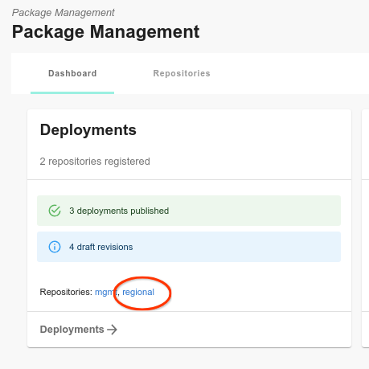


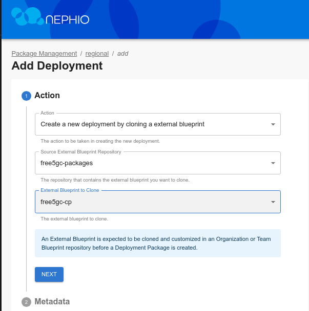

Click through the "Next" button until you are through all the steps, then
click "Add Deployment". On the next screen, click "Propose", and then
"Approve".

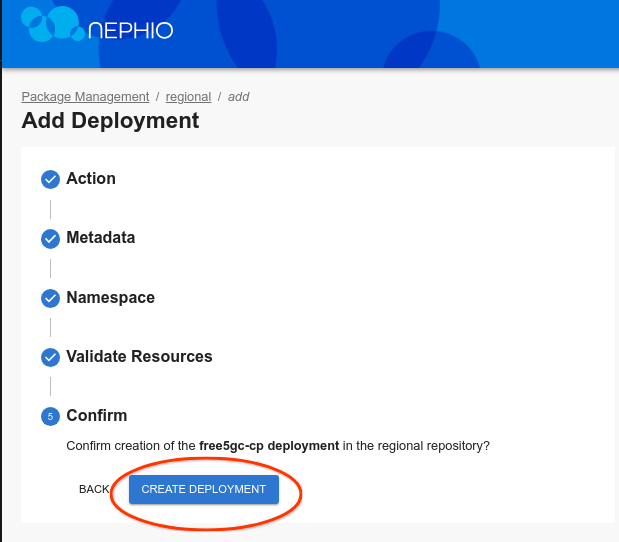

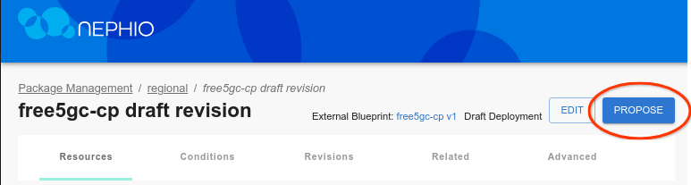

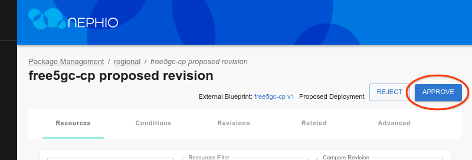

Shortly thereafter, you should see free5gc-cp in the cluster namespace:

```bash
kubectl get ns --context regional-admin@regional
```

<details>
<summary>The output is similar to:</summary>

```console
NAME                           STATUS   AGE
config-management-monitoring   Active   28m
config-management-system       Active   28m
default                        Active   28m
free5gc-cp                     Active   3m16s
kube-node-lease                Active   28m
kube-public                    Active   28m
kube-system                    Active   28m
local-path-storage             Active   28m
resource-group-system          Active   27m
```
</details>

And the actual workload resources:

```bash
kubectl -n free5gc-cp get all --context regional-admin@regional
```

<details>
<summary>The output is similar to:</summary>

```console
NAME                                 READY   STATUS    RESTARTS   AGE
pod/free5gc-ausf-7d494d668d-k55kb    1/1     Running   0          3m31s
pod/free5gc-nrf-66cc98cfc5-9mxqm     1/1     Running   0          3m31s
pod/free5gc-nssf-668db85d54-gsnqw    1/1     Running   0          3m31s
pod/free5gc-pcf-55d4bfd648-tk9fs     1/1     Running   0          3m31s
pod/free5gc-udm-845db6c9c8-54tfb     1/1     Running   0          3m31s
pod/free5gc-udr-79466f7f86-wh5bt     1/1     Running   0          3m31s
pod/free5gc-webui-84ff8c456c-g7q44   1/1     Running   0          3m31s
pod/mongodb-0                        1/1     Running   0          3m31s

NAME                    TYPE        CLUSTER-IP       EXTERNAL-IP   PORT(S)          AGE
service/ausf-nausf      ClusterIP   10.131.151.99    <none>        80/TCP           3m32s
service/mongodb         ClusterIP   10.139.208.189   <none>        27017/TCP        3m32s
service/nrf-nnrf        ClusterIP   10.143.64.94     <none>        8000/TCP         3m32s
service/nssf-nnssf      ClusterIP   10.130.139.231   <none>        80/TCP           3m31s
service/pcf-npcf        ClusterIP   10.131.19.224    <none>        80/TCP           3m31s
service/udm-nudm        ClusterIP   10.128.13.118    <none>        80/TCP           3m31s
service/udr-nudr        ClusterIP   10.137.211.80    <none>        80/TCP           3m31s
service/webui-service   NodePort    10.140.177.70    <none>        5000:30500/TCP   3m31s

NAME                            READY   UP-TO-DATE   AVAILABLE   AGE
deployment.apps/free5gc-ausf    1/1     1            1           3m31s
deployment.apps/free5gc-nrf     1/1     1            1           3m31s
deployment.apps/free5gc-nssf    1/1     1            1           3m31s
deployment.apps/free5gc-pcf     1/1     1            1           3m31s
deployment.apps/free5gc-udm     1/1     1            1           3m31s
deployment.apps/free5gc-udr     1/1     1            1           3m31s
deployment.apps/free5gc-webui   1/1     1            1           3m31s

NAME                                       DESIRED   CURRENT   READY   AGE
replicaset.apps/free5gc-ausf-7d494d668d    1         1         1       3m31s
replicaset.apps/free5gc-nrf-66cc98cfc5     1         1         1       3m31s
replicaset.apps/free5gc-nssf-668db85d54    1         1         1       3m31s
replicaset.apps/free5gc-pcf-55d4bfd648     1         1         1       3m31s
replicaset.apps/free5gc-udm-845db6c9c8     1         1         1       3m31s
replicaset.apps/free5gc-udr-79466f7f86     1         1         1       3m31s
replicaset.apps/free5gc-webui-84ff8c456c   1         1         1       3m31s

NAME                       READY   AGE
statefulset.apps/mongodb   1/1     3m31s
```
</details>

## Step 5: Deploy Free5GC Operator in the Workload clusters

Now you will need to deploy the free5gc operator across all of the Workload
clusters (regional and edge). To do this, you use another PackageVariantSet.
This one uses an objectSelector to select the WorkloadCluster resources
previously added to the Management cluster when you had deployed the
nephio-workload-cluster packages (manually as well as via
PackageVariantSet).

```bash
kubectl apply -f test-infra/e2e/tests/004-free5gc-operator.yaml
```

<details>
<summary>The output is similar to:</summary>

```console
packagevariantset.config.porch.kpt.dev/free5gc-operator created
```
</details>

## Step 6: Check Free5GC Operator Deployment

Within five minutes of applying the free5gc Operator YAML file, you should see `free5gc` namespaces on
your regional and edge clusters:

```bash
kubectl get ns --context edge01-admin@edge01
```

<details>
<summary>The output is similar to:</summary>

```console
NAME                           STATUS   AGE
config-management-monitoring   Active   3h46m
config-management-system       Active   3h46m
default                        Active   3h47m
free5gc                        Active   159m
kube-node-lease                Active   3h47m
kube-public                    Active   3h47m
kube-system                    Active   3h47m
resource-group-system          Active   3h45m
```
</details>

```bash
kubectl -n free5gc get all --context edge01-admin@edge01
```

<details>
<summary>The output is similar to:</summary>

```console
NAME                                                          READY   STATUS    RESTARTS   AGE
pod/free5gc-operator-controller-controller-58df9975f4-sglj6   2/2     Running   0          164m

NAME                                                     READY   UP-TO-DATE   AVAILABLE   AGE
deployment.apps/free5gc-operator-controller-controller   1/1     1            1           164m

NAME                                                                DESIRED   CURRENT   READY   AGE
replicaset.apps/free5gc-operator-controller-controller-58df9975f4   1         1         1       164m
```
</details>

## Step 7: Deploy the AMF, SMF and UPF NFs

Finally, you can deploy the individual network functions which the operator will
instantiate. For now, you will use individual PackageVariants targeting the Regional
cluster for each of the AMF and SMF NFs and a PackageVariantSet targeting the
Edge clusters for the UPF NFs. In the future, you could put all of these
resources into yet-another-package - a "topology" package - and deploy them all as a
unit. Or you can use a topology controller to create them. But for now, let's do each
manually.

```bash
kubectl apply -f test-infra/e2e/tests/005-edge-free5gc-upf.yaml
kubectl apply -f test-infra/e2e/tests/006-regional-free5gc-amf.yaml
kubectl apply -f test-infra/e2e/tests/006-regional-free5gc-smf.yaml
```

Free5gc requires that the SMF and AMF NFs be explicitly configured with information
about each UPF. Therefore, the AMF and SMF packages will remain in an "unready"
state until the UPF packages have all been published.

### Check UPF deployment

You can check the UPF logs in edge01 cluster:

```bash
UPF1_POD=$(kubectl get pods -n free5gc-upf -l name=upf-edge01 --context edge01-admin@edge01 -o jsonpath='{.items[0].metadata.name}')
kubectl -n free5gc-upf logs $UPF1_POD --context edge01-admin@edge01
```

<details>
<summary>The output is similar to:</summary>

```console
2023-07-15T09:05:51Z [INFO][UPF][Main] UPF version:
	free5GC version: v3.2.1
	build time:      2023-06-09T16:41:08Z
	commit hash:     4972fffb
	commit time:     2022-06-29T05:46:33Z
	go version:      go1.20.5 linux/amd64
2023-07-15T09:05:51Z [INFO][UPF][Cfg] Read config from [/free5gc/config/upfcfg.yaml]
2023-07-15T09:05:51Z [INFO][UPF][Cfg] ==================================================
2023-07-15T09:05:51Z [INFO][UPF][Cfg] (*factory.Config)(0xc0003c25f0)({
	Version: (string) (len=5) "1.0.3",
	Description: (string) (len=17) "UPF configuration",
	Pfcp: (*factory.Pfcp)(0xc0003d2fc0)({
		Addr: (string) (len=11) "172.1.1.254",
		NodeID: (string) (len=11) "172.1.1.254",
		RetransTimeout: (time.Duration) 1s,
		MaxRetrans: (uint8) 3
	}),
	Gtpu: (*factory.Gtpu)(0xc0003d3170)({
		Forwarder: (string) (len=5) "gtp5g",
		IfList: ([]factory.IfInfo) (len=1 cap=1) {
			(factory.IfInfo) {
				Addr: (string) (len=11) "172.3.0.254",
				Type: (string) (len=2) "N3",
				Name: (string) "",
				IfName: (string) ""
			}
		}
	}),
	DnnList: ([]factory.DnnList) (len=1 cap=1) {
		(factory.DnnList) {
			Dnn: (string) (len=8) "internet",
			Cidr: (string) (len=11) "10.1.0.0/24",
			NatIfName: (string) (len=2) "n6"
		}
	},
	Logger: (*factory.Logger)(0xc000378be0)({
		Enable: (bool) true,
		Level: (string) (len=4) "info",
		ReportCaller: (bool) false
	})
})
2023-07-15T09:05:51Z [INFO][UPF][Cfg] ==================================================
2023-07-15T09:05:51Z [INFO][UPF][Main] Log level is set to [info] level
2023-07-15T09:05:51Z [INFO][UPF][Main] starting Gtpu Forwarder [gtp5g]
2023-07-15T09:05:51Z [INFO][UPF][Main] GTP Address: "172.3.0.254:2152"
2023-07-15T09:05:51Z [INFO][UPF][Buff] buff server started
2023-07-15T09:05:51Z [INFO][UPF][Pfcp][172.1.1.254:8805] starting pfcp server
2023-07-15T09:05:51Z [INFO][UPF][Pfcp][172.1.1.254:8805] pfcp server started
2023-07-15T09:05:51Z [INFO][UPF][Main] UPF started
2023-07-15T09:10:45Z [INFO][UPF][Pfcp][172.1.1.254:8805] handleAssociationSetupRequest
2023-07-15T09:10:45Z [INFO][UPF][Pfcp][172.1.1.254:8805][rNodeID:172.1.0.254] New node
```
</details>

### Check AMF deployment

You can check the AMF logs:

```bash
AMF_POD=$(kubectl get pods -n free5gc-cp -l name=amf-regional --context regional-admin@regional -o jsonpath='{.items[0].metadata.name}')
kubectl -n free5gc-cp logs $AMF_POD --context regional-admin@regional
```

<details>
<summary>The output is similar to:</summary>

```console
2023-07-15T09:08:55Z [INFO][AMF][CFG] config version [1.0.3]
2023-07-15T09:08:55Z [INFO][AMF][Init] AMF Log level is set to [info] level
2023-07-15T09:08:55Z [INFO][LIB][NAS] set log level : info
2023-07-15T09:08:55Z [INFO][LIB][NAS] set report call : false
2023-07-15T09:08:55Z [INFO][LIB][NGAP] set log level : info
2023-07-15T09:08:55Z [INFO][LIB][NGAP] set report call : false
2023-07-15T09:08:55Z [INFO][LIB][FSM] set log level : info
2023-07-15T09:08:55Z [INFO][LIB][FSM] set report call : false
2023-07-15T09:08:55Z [INFO][LIB][Aper] set log level : info
2023-07-15T09:08:55Z [INFO][LIB][Aper] set report call : false
2023-07-15T09:08:55Z [INFO][AMF][App] amf
2023-07-15T09:08:55Z [INFO][AMF][App] AMF version:
	free5GC version: v3.2.1
	build time:      2023-06-09T16:40:22Z
	commit hash:     a3bd5358
	commit time:     2022-05-01T14:58:26Z
	go version:      go1.20.5 linux/amd64
2023-07-15T09:08:55Z [INFO][AMF][Init] Server started
2023-07-15T09:08:55Z [INFO][AMF][Util] amfconfig Info: Version[1.0.3] Description[AMF initial local configuration]
2023-07-15T09:08:55Z [INFO][AMF][NGAP] Listen on 172.2.2.254:38412
```
</details>

### Check SMF deployment

You can check the SMF logs:

```bash
SMF_POD=$(kubectl get pods -n free5gc-cp -l name=smf-regional --context regional-admin@regional -o jsonpath='{.items[0].metadata.name}')
kubectl -n free5gc-cp logs $SMF_POD --context regional-admin@regional
```

<details>
<summary>The output is similar to:</summary>

```console
2023-07-15T09:10:45Z [INFO][SMF][CFG] SMF config version [1.0.2]
2023-07-15T09:10:45Z [INFO][SMF][CFG] UE-Routing config version [1.0.1]
2023-07-15T09:10:45Z [INFO][SMF][Init] SMF Log level is set to [debug] level
2023-07-15T09:10:45Z [INFO][LIB][NAS] set log level : info
2023-07-15T09:10:45Z [INFO][LIB][NAS] set report call : false
2023-07-15T09:10:45Z [INFO][LIB][NGAP] set log level : info
2023-07-15T09:10:45Z [INFO][LIB][NGAP] set report call : false
2023-07-15T09:10:45Z [INFO][LIB][Aper] set log level : info
2023-07-15T09:10:45Z [INFO][LIB][Aper] set report call : false
2023-07-15T09:10:45Z [INFO][LIB][PFCP] set log level : info
2023-07-15T09:10:45Z [INFO][LIB][PFCP] set report call : false
2023-07-15T09:10:45Z [INFO][SMF][App] smf
2023-07-15T09:10:45Z [INFO][SMF][App] SMF version:
	free5GC version: v3.2.1
	build time:      2023-06-09T16:40:53Z
	commit hash:     de70bf6c
	commit time:     2022-06-28T04:52:40Z
	go version:      go1.20.5 linux/amd64
2023-07-15T09:10:45Z [INFO][SMF][CTX] smfconfig Info: Version[1.0.2] Description[SMF configuration]
2023-07-15T09:10:45Z [INFO][SMF][CTX] Endpoints: [172.3.0.254]
2023-07-15T09:10:45Z [INFO][SMF][CTX] Endpoints: [172.3.1.254]
2023-07-15T09:10:45Z [INFO][SMF][Init] Server started
2023-07-15T09:10:45Z [INFO][SMF][Init] SMF Registration to NRF {7011c946-4ca4-45ff-bac6-32116bd93934 SMF REGISTERED 0 0xc0001da168 0xc0001da198 [] []   [smf-regional] [] <nil> [] [] <nil> 0 0 0 area1 <nil> <nil> <nil> <nil> 0xc0000b81c0 <nil> <nil> <nil> <nil> <nil> map[] <nil> false 0xc0001da060 false false []}
2023-07-15T09:10:45Z [INFO][SMF][PFCP] Listen on 172.1.0.254:8805
2023-07-15T09:10:45Z [INFO][SMF][App] Sending PFCP Association Request to UPF[172.1.1.254]
2023-07-15T09:10:45Z [INFO][LIB][PFCP] Remove Request Transaction [1]
2023-07-15T09:10:45Z [INFO][SMF][App] Received PFCP Association Setup Accepted Response from UPF[172.1.1.254]
2023-07-15T09:10:45Z [INFO][SMF][App] Sending PFCP Association Request to UPF[172.1.2.254]
2023-07-15T09:10:45Z [INFO][LIB][PFCP] Remove Request Transaction [2]
2023-07-15T09:10:45Z [INFO][SMF][App] Received PFCP Association Setup Accepted Response from UPF[172.1.2.254]
```
</details>

## Step 8: Deploy UERANSIM

The UERANSIM package can be deployed to the edge01 cluster, where it will
simulate a gNodeB and UE. Just like our other packages, UERANSIM needs to be
configured to attach to the correct networks and use the correct IP address.
Thus, you use our standard specialization techniques and pipeline to deploy
UERANSIM, just like the other network functions.

However, before you do that, let us register the UE with free5gc as a subscriber.
You will use the free5gc Web UI to do this. To access it, you need to open
another port forwarding session. Assuming you have the `regional-kubeconfig`
file you created earlier in your home directory, you need to establish another
ssh session from your workstation to the VM, port forwarding port 5000.

Before moving on to the new terminal, let's copy `regional-kubeconfig` to the home directory:

```bash
cp $HOME/.kube/regional-kubeconfig .
```

Then, use the same form of the command you did for other sessions. For example, for the
generic Ubuntu VM, the command would be:

```bash
ssh <user>@<vm-address> \
                -L 5000:localhost:5000 \
                kubectl --kubeconfig regional-kubeconfig \
                port-forward --namespace=free5gc-cp svc/webui-service 5000
```

You should now be able to navigate to
[http://localhost:5000/](http://localhost:5000/) and access the free5gc WebUI.
The test subscriber is the same as the standard free5gc default subscriber.
Thus, you can follow the
[instructions](https://free5gc.org/guide/Webconsole/Create-Subscriber-via-webconsole/) on the
free5gc site, but start at Step 4.

Once the subscriber is registered, you can deploy UERANSIM:

```bash
kubectl apply -f test-infra/e2e/tests/007-edge01-ueransim.yaml
```

You can check to see if the simulated UE is up and running by checking the
UERANSIM deployment. First, you can use the `get_capi_kubeconfig` shortcut to
retrieve the kubeconfig for the edge01 cluster, and then query that cluster for
the UERANSIM pods.

```bash
get_capi_kubeconfig edge01
kubectl --kubeconfig edge01-kubeconfig -n ueransim get po
```

<details>
<summary>The output is similar to:</summary>

```console
NAME                                  READY   STATUS    RESTARTS   AGE
ueransimgnb-edge01-748b45f684-sbs8h   1/1     Running   0          81m
ueransimue-edge01-56fccbc4b6-h42k7    1/1     Running   0          81m
```

</details>

Let's see if you can simulate the UE pinging out to our DNN.

```bash
UE_POD=$(kubectl --kubeconfig edge01-kubeconfig get pods -n ueransim -l app=ueransim -l component=ue -o jsonpath='{.items[0].metadata.name}')
kubectl --kubeconfig edge01-kubeconfig -n ueransim exec -it $UE_POD -- /bin/bash -c "ping -I uesimtun0 172.0.0.1"
```

<details>
<summary>The output is similar to:</summary>

```console
PING 172.0.0.1 (172.0.0.1) from 10.1.0.2 uesimtun0: 56(84) bytes of data.
64 bytes from 172.0.0.1: icmp_seq=1 ttl=63 time=7.01 ms
64 bytes from 172.0.0.1: icmp_seq=2 ttl=63 time=6.28 ms
64 bytes from 172.0.0.1: icmp_seq=3 ttl=63 time=8.89 ms
64 bytes from 172.0.0.1: icmp_seq=4 ttl=63 time=8.15 ms
^C
--- 172.0.0.1 ping statistics ---
4 packets transmitted, 4 received, 0% packet loss, time 3003ms
rtt min/avg/max/mdev = 6.280/7.586/8.896/1.011 ms
```

</details>

Note that our DNN does not actually provide access to the internet, so you won't
be able to reach the other sites.

## Step 9: Change the Capacities of the UPF and SMF NFs

In this step, you will change the capacity requirements for the UPF and SMF, and
see how the operator reconfigures the Kubernetes resources used by the network
functions.

The capacity requirements are captured in a custom resource (capacity.yaml) within the deployed
package. You can edit this value with the CLI, or use the web interface. Both options lead to the same result, but using the web interface is faster. 
First, you will vertically scale the UPF using the CLI.

To create a new package revision, you need to start by retrieving the PackageVariant downstream target name.

```bash
kubectl config use kind-kind
kubectl get packagevariant edge-free5gc-upf-edge01-free5gc-upf -o jsonpath='{.status.downstreamTargets[0].name}'

```
<details>
<summary>The output is similar to:</summary>

```console
edge01-e827e1b4d5ea1d76d1514de20d1ee27bf884c72e
```
</details>
This way you retrieve the downstream target name of the package. You can also retrieve this information by using the `kubectl describe` command on the UPF PackageVariant.

Next create a new package revision from the existing UPF package.

```bash
kpt alpha rpkg copy -n default edge01-e827e1b4d5ea1d76d1514de20d1ee27bf884c72e --workspace upf-scale-package 
```
<details>
<summary>The output is similar to:</summary>

```console
edge01-40c616e5d87053350473d3ffa1387a9a534f8f42 created
```
</details>
The output contains the package revision of our newly cloned upf package.
Pull the package to a local directory of your choice (in the example you can use /tmp/upf-scale-package). 

```bash
kpt alpha rpkg pull -n default edge01-40c616e5d87053350473d3ffa1387a9a534f8f42 /tmp/upf-scale-package
```
You can inspect the contents of the package in the chosen directory. The UPF configuration is located in the capacity.yaml file.

```bash
cat /tmp/upf-scale-package/capacity.yaml 
```
<details>
<summary>The output is similar to:</summary>

```console
apiVersion: req.nephio.org/v1alpha1
kind: Capacity
metadata: # kpt-merge: /dataplane
  name: dataplane
  annotations:
    config.kubernetes.io/local-config: "true"
    specializer.nephio.org/owner: workload.nephio.org/v1alpha1.UPFDeployment.upf-edge01
    specializer.nephio.org/namespace: free5gc-upf
    internal.kpt.dev/upstream-identifier: 'req.nephio.org|Capacity|default|dataplane'
spec:
  maxUplinkThroughput: 5G
  maxDownlinkThroughput: 5G
```
</details>

The contents of the package will be mutated using kpt functions to adjust the UPF configuration, however you can also manually edit the file.
Apply the kpt functions to the contents of the kpt package with a new value for the throughputs of your choice.
```bash
kpt fn eval --image gcr.io/kpt-fn/search-replace:v0.2.0 /tmp/upf-scale-package -- by-path='spec.maxUplinkThroughput' by-file-path='**/capacity.yaml' put-value=10
kpt fn eval --image gcr.io/kpt-fn/search-replace:v0.2.0 /tmp/upf-scale-package -- by-path='spec.maxDownlinkThroughput' by-file-path='**/capacity.yaml' put-value=10
```
<details>
<summary>The output is similar to:</summary>

```console
[RUNNING] "gcr.io/kpt-fn/search-replace:v0.2.0"
[PASS] "gcr.io/kpt-fn/search-replace:v0.2.0" in 6.3s
  Results:
    [info] spec.maxUplinkThroughput: Mutated field value to "10"
```
</details>

Observe the changes to the UPF configuration using the kpt pkg diff command.
```bash
kpt pkg diff /tmp/upf-scale-package | grep linkThroughput
``` 

<details>
<summary>The output is similar to:</summary>

```console
From https://github.com/nephio-project/free5gc-packages
 * tag               pkg-example-upf-bp/v3 -> FETCH_HEAD
Adding package "pkg-example-upf-bp".
<   maxUplinkThroughput: 10G
<   maxDownlinkThroughput: 10
>   maxUplinkThroughput: 5G
>   maxDownlinkThroughput: 5G
```
</details>

Next, progress through the package lifecycle stages by pushing the changes to the package to its repository, proposing the changes and approving them.

```bash
kpt alpha rpkg push -n default edge01-40c616e5d87053350473d3ffa1387a9a534f8f42 /tmp/upf-scale-package
kpt alpha rpkg propose -n default edge01-40c616e5d87053350473d3ffa1387a9a534f8f42
kpt alpha rpkg approve -n default edge01-40c616e5d87053350473d3ffa1387a9a534f8f42
```
<details>
<summary>The output is similar to:</summary>

```console
edge01-40c616e5d87053350473d3ffa1387a9a534f8f42 proposed
edge01-40c616e5d87053350473d3ffa1387a9a534f8f42 approved
```
</details>

You can check the current lifecycle stage of a package using the `kpt alpha rpkg get` command.
```bash
kpt alpha rpkg get
```

<details>
<summary>The output is similar to:</summary>

```console
NAME                                                               PACKAGE                              WORKSPACENAME          REVISION   LATEST   LIFECYCLE   REPOSITORY
edge01-e72d245b864db0fd234d9b4ead2f96edcf6bb3e4                    free5gc-operator                     packagevariant-1       main       false    Published   edge01
edge01-7c9bf9f43768ecd2b45a8be84698763cdd2593b6                    free5gc-operator                     packagevariant-1       v1         true     Published   edge01
edge01-40c616e5d87053350473d3ffa1387a9a534f8f42                    free5gc-upf                          upf-scale-package      v2         true     Published   edge01
```
</details>

Additionally you can check the Gitea edge01 repository (accessible at http://localhost:3000/nephio/edge01) for new commits to see how Porch interacts with packages stored in Git repositories.

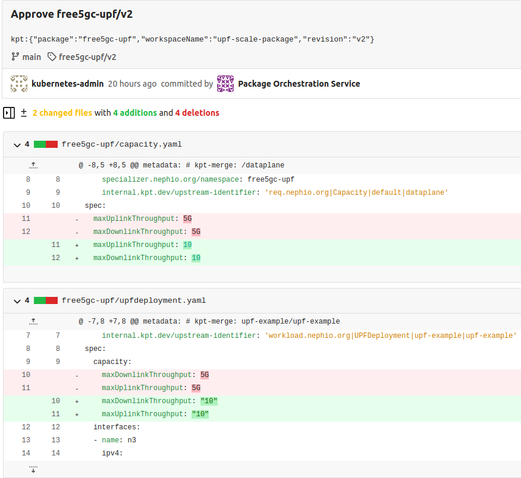

After the package is approved, the results can be observed in Nephio Web UI. Head over to http://localhost:7007/config-as-data ([port forwarding](https://github.com/nephio-project/docs/blob/main/install-guide/README.md#access-to-the-user-interfaces/) must be running).

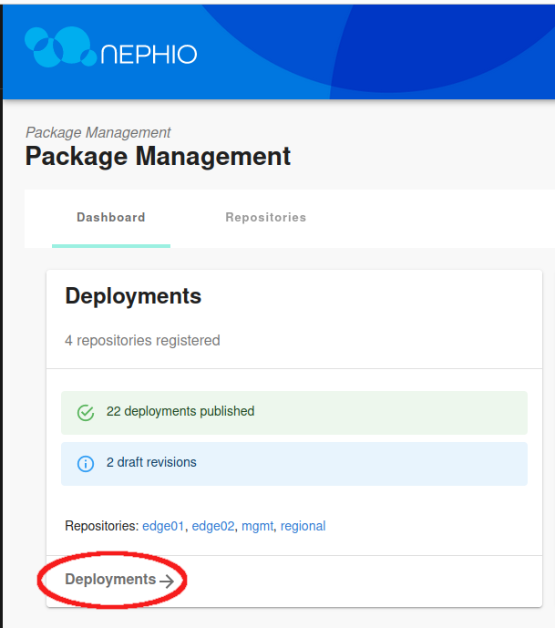

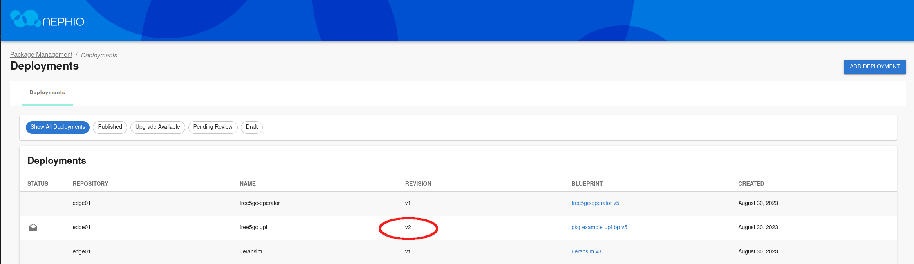

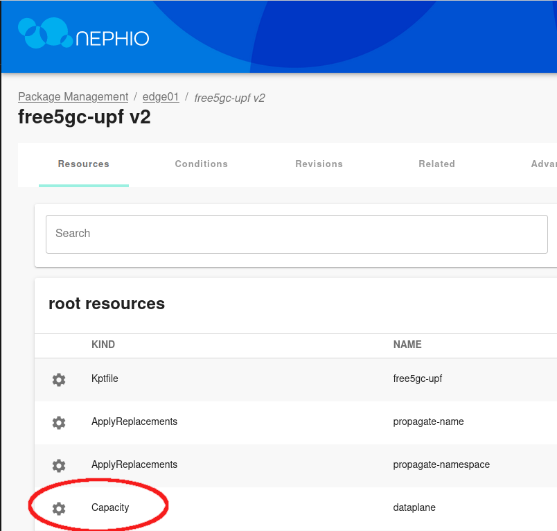

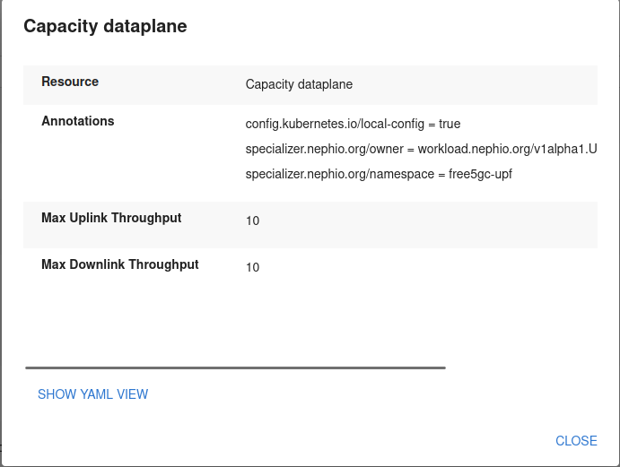

Inside the package, you can see that the throughput values for UPF have been modified, reflecting the changes you made with the CLI.

You can also scale NFs vertically using the Nephio Web UI. For practice you can scale the UPF on the second edge cluster. Once again, navigate to the Web UI and choose the `edge02` repository in the Deployments section.

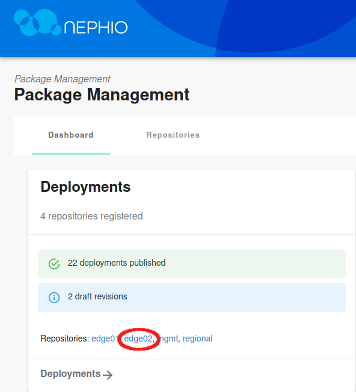

Select the `free5gc-upf` deployment, and then `View draft revision`.

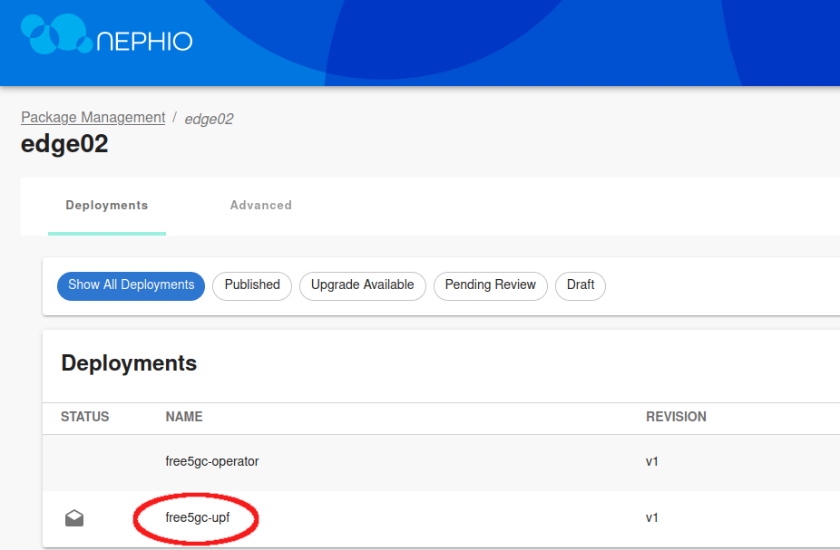

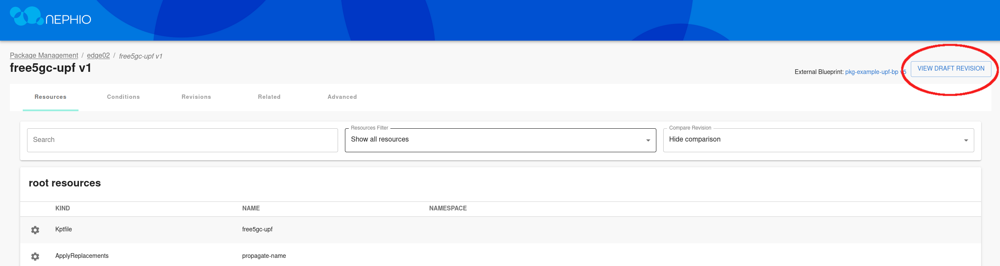

Edit the draft revision, and modify the `Capacity.yaml` file.

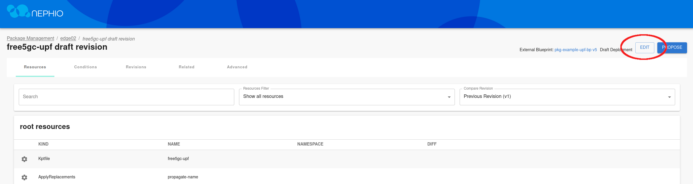

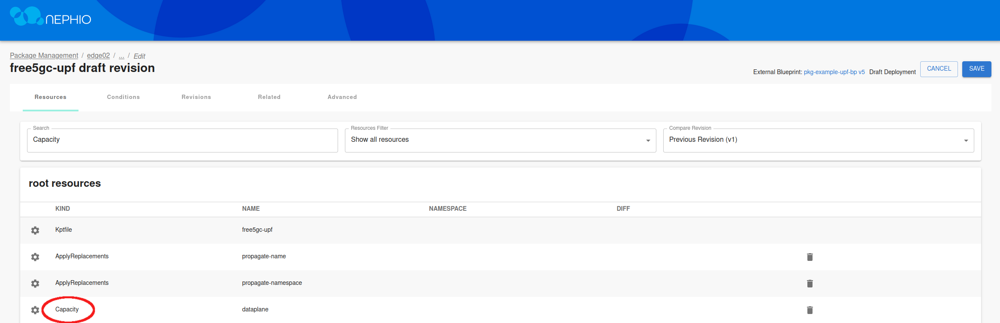

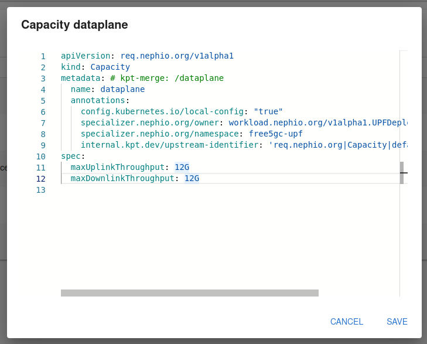

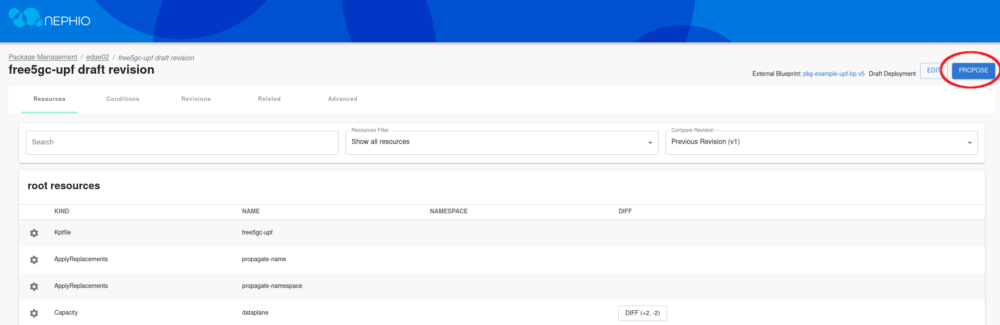

After saving the changes to the file, propose the draft package and approve it.

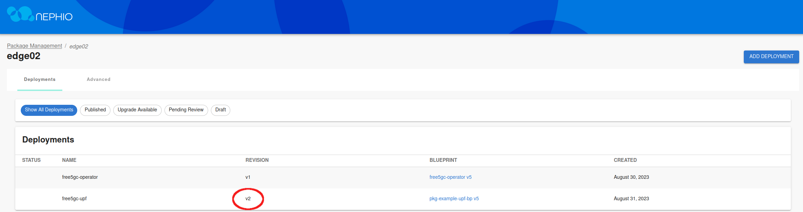

After a few minutes, the revision for the UPF deployment will change, and the changes will be reflected in the `edge-02` cluster.
